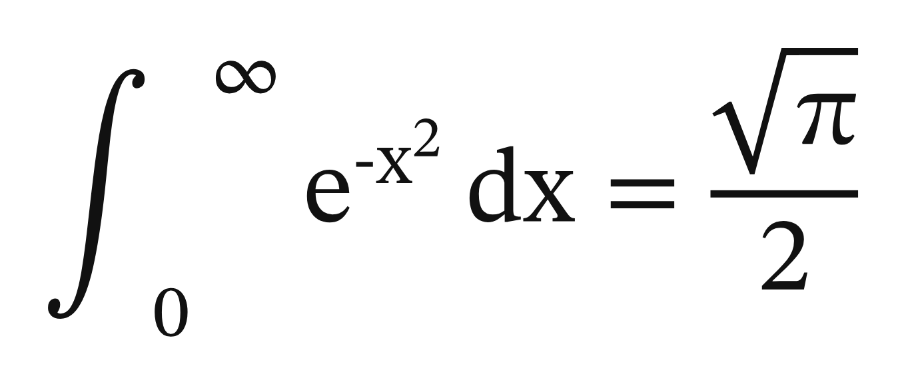
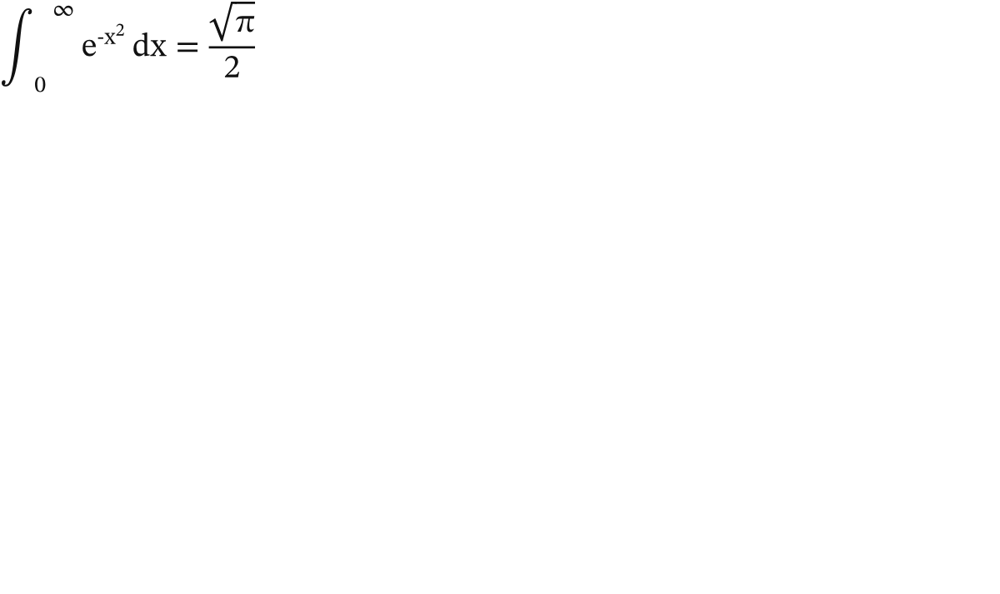

# LatteX ☕

**Math, Y'all** — LaTeX math rendered to SVG, for the JVM.

LatteX is a clean-room, pure-**Java 25** library that renders LaTeX math to **SVG** — inline and display, baseline-accurate — with **zero runtime dependencies**. No JavaScript engine, no headless browser, no external `tex` binary. Point it at `\frac{1}{2}` and get back a crisp, scalable, self-contained `<svg>`.

```java
String svg = com.lattex.api.LatteX.render("\\frac{a+b}{c}");
```

> **Acknowledgments.** LatteX is a *clean-room* implementation — its layout is derived from Knuth's *TeXbook* (Appendix G) and the OpenType-MATH / SVG specifications, not from any existing renderer's source. That said, a grateful hat-tip to **[KaTeX](https://katex.org)**: we used its superb *supported-functions* coverage as a **feature reference** — *what* LaTeX commands are worth supporting — to shape our roadmap. Thanks also to the **STIX Two Math** font (SIL OFL) that LatteX bundles, and to the wider TeX/LaTeX ecosystem it stands on.

## See it

Every public render entry throws exactly one typed exception — `MathSyntaxException`,
caret-pointing for syntax errors, containment-wrapped (cause preserved) for internal
layout/emit failures — so an `Error` can never escape onto a live page.

**[examples/showcase.html](examples/showcase.html)** — a curated tour of what
LatteX renders (every formula on it is regression-locked by the wild-corpus
ratchet: 481/484 real-world formulas, 99.4%, and only allowed to go up). For the
fx layer in motion, see the **[effects showcase](examples/effects.html)** — all
26 animated effects live — and **[the fx gallery](examples/GALLERY.md)** for
captured previews (every effect as its own looping GIF). For the parallel MathML
output, **[examples/mathml.html](examples/mathml.html)** shows each formula's SVG
render beside its `toMathML()` serialization — same parse, two products.


<sub>↑ a scroll through <code>examples/showcase.html</code>, captured with <a href="https://github.com/supsup/BrewShot">BrewShot</a> — every frame is real renderer output.</sub>

## Why

The JVM lacks a modern, permissively-licensed, web-first math renderer. KaTeX and MathJax are JavaScript. JLaTeXMath is excellent but old (AWT/image-first) **and GPL**. SnuggleTeX is permissive but limited to MathML. LatteX fills that gap: **Apache-2.0, pure Java, SVG-native.**

## Design

- **Java 25, modern.** The math tree is a `sealed interface` + `record` algebraic data type, laid out with exhaustive pattern-matching switches — no visitor boilerplate.
- **Zero runtime dependencies, framework-free.** No Spring, no anything. A JPMS module you drop in and call. The glyphs come from a bundled OFL math font (STIX Two Math), emitted as SVG `<path>`s — so there are no fonts to load in the browser either.
- **SVG-native, inline-capable.** Output is a minimal, sanitizer-friendly SVG subset — only `<svg>`/`<g>`/`<path>`/`<rect>`, with glyphs as inline filled `<path>`s (no `<text>`/`<use>`/`<defs>`/`<script>`). The renderer exposes each expression's height and depth so inline math sits correctly on the text baseline.
- **Native-image clean.** No reflection; ships GraalVM reachability metadata, and an optional standalone `lattex` native CLI.
- **Design-for-both, ship SVG.** A layout core + pluggable output backends (mirroring TeX's own `dvisvgm`/`dvipng` driver split): SVG natively, with **[`bin/lattex-shot`](#png-export--binlattex-shot)** for a tightly-cropped **PNG** raster (as glue over [BrewShot](https://github.com/supsup/BrewShot), no new dependency).

## Status

Early but real. The parse → layout → SVG pipeline is wired end-to-end: `com.lattex.api.LatteX.render(...)` renders fractions, roots, scripts, big operators, matrices, aligned environments, delimiters, stacked annotations (`\underbrace`/`\overbrace`/`\substack`/`\stackrel`/`\overset`/`\underset`), extensible labelled arrows (`\xrightarrow`/`\xleftarrow`), style-pinned fractions (`\dfrac`/`\tfrac`), per-subterm color (`\color`/`\textcolor`), equation numbering (`\tag`), manual delimiter sizing (`\big`/`\Big`/`\bigg`/`\Bigg`), and bare style switches (`\displaystyle`/`\textstyle`/`\scriptstyle`) to SVG today — **99.4% of the wild corpus** as of **0.5.0**. A parallel `LatteX.toMathML(...)` emits **Presentation-MathML** from the same parse tree — navigable structure for assistive tech and an interop surface. The `\lx[...]{...}` author syntax, inline em-sizing + baseline alignment, and the full **26-effect** `fx` layer are on the mainline, with parse-time DoS guards. See **[QUICKSTART.md](QUICKSTART.md)** for usage and cross-stack integration.

## The fx layer is OPTIONAL

The math renders from the jar **alone** — pure, inert `svg/g/path/rect`, no runtime, safe to inline anywhere. The `\lx` **effects** (glow, handscribe, supernova, shatter, sparkler, and 20 more) are an *opt-in* layer: they ride the `<span class="lx-math" data-lx-fx-*>` wrapper and are driven by a small vanilla-JS runtime **bundled in the jar**. Include it only if you want the animations.

On the JVM, read the assets straight off the API:

```java
LatteX.fxRuntimeJs()   // the runtime — serve as /js/lattex-fx.js, or inline in a trusted <script>
LatteX.fxStylesCss()   // the styles — serve as /css/lattex-fx.css, or inline in a <style>
```

Not on the JVM? They're plain jar resources — extract them at build time in any stack:

```bash
unzip -p lattex-0.5.0.jar com/lattex/fx/lattex-fx.js  > static/js/lattex-fx.js
unzip -p lattex-0.5.0.jar com/lattex/fx/lattex-fx.css > static/css/lattex-fx.css
```

Either way the consumer gets them **from the jar it already renders with** — no separately-managed asset, and the runtime can never drift from the renderer that stamped the attributes. Three rules from real integrations: extract from the **same jar version** you render with (never a cached copy); ship the js and css **together or not at all** (the css pre-hides `fx.enter` equations for the js to reveal); load the script with `defer` so it runs after the math is in the DOM. Full stack-by-stack walkthrough: **[SLOWSTART.md](SLOWSTART.md)** Scenario 4. Browse the whole catalogue live in `examples/effects.html` — or see it without building anything: **[the fx gallery](examples/GALLERY.md)** has real-browser screenshots and GIFs of the effects in motion, captured by [BrewShot](https://github.com/supsup/BrewShot) on every full test run.

## PNG export — `bin/lattex-shot`

LatteX's native output is **SVG** — a *vector* format that stays razor-sharp at any
size. But some destinations don't accept SVG: Slack messages, a GitHub issue body, a
slide deck, an LMS upload. For those you need a **raster** image — a **PNG**, a fixed
grid of pixels. `bin/lattex-shot` produces that PNG.

It is deliberately **glue, not a new dependency**: it doesn't contain a rasterizer of
its own. It shells out to two tools you already have — the LatteX jar (to render the
math) and [BrewShot](https://github.com/supsup/BrewShot), a zero-dependency headless-
Chrome screenshot harness (to turn the rendered page into pixels).

### Quick start

```bash
./gradlew jar                                          # 1. build the lattex jar

bin/lattex-shot '\int_0^\infty e^{-x}dx = 1' -o eq.png # 2a. LaTeX as an argument
echo '\frac{a}{b}' | bin/lattex-shot - -o frac.png     # 2b. or piped via stdin (the '-')
bin/lattex-shot 'E = mc^2' --scale 4 --bg transparent -o hero.png   # 2c. bigger + transparent
```

The first positional argument is the LaTeX math. Passing `-` instead reads the LaTeX
from **stdin**, so you can pipe it from another command or a file (`cat eq.tex | bin/lattex-shot - -o eq.png`).

Here is the actual result — this very PNG was produced by running

```bash
bin/lattex-shot '\int_0^\infty e^{-x^2}\,dx = \frac{\sqrt{\pi}}{2}' --scale 4 -o examples/lattex-shot-example.png
```

and committed straight from the pipeline, nothing hand-touched (the docs eat their own
dog food):



Note what you get for free: the glyphs are razor-sharp (it's vector, rendered at 4×),
the crop hugs the equation exactly, and it's centered with even padding — ready to drop
straight into a doc.

### How it works (the pipeline)

1. **Render.** LatteX turns your LaTeX into a self-contained SVG whose width/height are
   the *exact* typeset metrics of the math (no guessed bounding box).
2. **Wrap.** The SVG is dropped into a minimal one-off HTML page. A wrapper `<div>`
   carries the background color, the ink color, the padding, and the scale.
3. **Scale.** The wrapper is enlarged with a **CSS `transform: scale(N)`** (see the note
   below on *why* a CSS transform rather than resizing the SVG).
4. **Shoot + crop.** BrewShot opens the page in headless Chrome and screenshots the
   wrapper's exact on-screen rectangle (via `getBoundingClientRect()`, which already
   includes the scale and padding). The result is **tightly cropped** to the math — no
   whitespace-trim heuristics, no stray margins.

### Flags

| Flag | Meaning | Default |
|---|---|---|
| `-o FILE` | Output PNG path. | `lattex.png` |
| `--scale N` | **Vector scale factor.** Because the source is SVG (vector), a larger scale means *more pixels* — a genuinely sharper image, **not** a blurry upscale of a small one. `3` is roughly "@3x" / retina-crisp; use `4`+ for hero/print. | `3` |
| `--bg COLOR` | Background — any CSS color. Use **`transparent`** for no background (e.g. to drop the equation onto a colored slide). | `#ffffff` (white) |
| `--color COLOR` | The **ink**: the color of the math glyphs themselves. | `#111111` (near-black) |
| `--pad PX` | Padding (breathing room) around the math, measured **at scale 1** — it is scaled along with everything else. | `16` |

### Setup it needs

- **The LatteX jar** — build it once with `./gradlew jar`. The script auto-finds the
  newest `build/libs/lattex-*.jar`; override the path with the `LATTEX_JAR` env var.
- **BrewShot** — a `brewshot` executable on your `PATH`, or point `BREWSHOT` at the
  binary or `.jar`. (If it's a jar, the script runs it as `java -jar`.)

If either is missing, or the LaTeX renders to nothing, the script exits non-zero with a
one-line reason on stderr (jar/brewshot not found → exit 3; nothing rendered → exit 4).

### What you'd get without it

To see why the scale-and-crop step matters, here is the **same equation** done the
naïve way — just drop LatteX's SVG onto a page and screenshot the window, with no
scaling and no crop:



The math is correct, but it's tiny (native 1× size), stranded in the top-left, and
swimming in whitespace — so you'd be left hand-cropping and upscaling a raster (which
*does* go blurry). `lattex-shot` gives you the sharp, tight top image instead, in one
command. (Naïvely rewriting the SVG's `width`/`height` to scale it up doesn't save you
either: it mis-sizes the box and **clips the edges** — the `√π` and fraction fall off
the right — and can mis-compose glyphs that LatteX places with their own SVG transforms.)

### Why a CSS transform, and why the exact crop

Two implementation choices are what make the top image clean:

- **Scaling is a CSS transform, not an SVG width/height rewrite.** A CSS
  `transform: scale()` enlarges the already-composed picture uniformly, so every glyph
  stays exactly where the layout put it — avoiding the clipping / mis-composition the
  naïve `width`/`height` rewrite above runs into.
- **The crop clips to the rendered box.** Because BrewShot clips to the wrapper's
  measured rectangle (`getBoundingClientRect()`, which already includes the scale and
  padding), the PNG is exactly the math plus your `--pad` — no dependence on fragile
  "trim the surrounding whitespace" image post-processing.

## Build

```bash
./gradlew build
```

Requires a Java 25 toolchain (Gradle provisions it via the toolchain spec).

## License

- **Code:** [Apache-2.0](LICENSE).
- **Bundled math font:** STIX Two Math, under the SIL Open Font License (OFL) — see `NOTICE`.

## Contributing

LatteX is a **clean-room** implementation. Before contributing, read [CONTRIBUTING.md](CONTRIBUTING.md) — in particular the rule that we implement from the *primary sources* (Knuth's TeXbook + the OpenType/SVG specs), **never** from other renderers' code.

## Disclaimer

This project is provided under the Apache License 2.0 on an "AS IS" basis, without warranties or conditions of any kind. See the LICENSE file for details.
