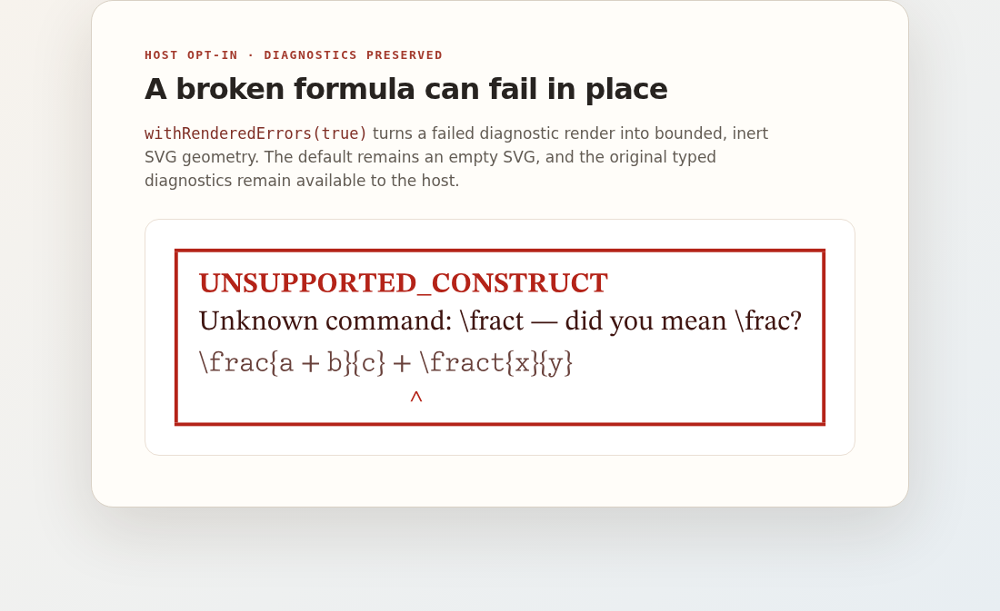
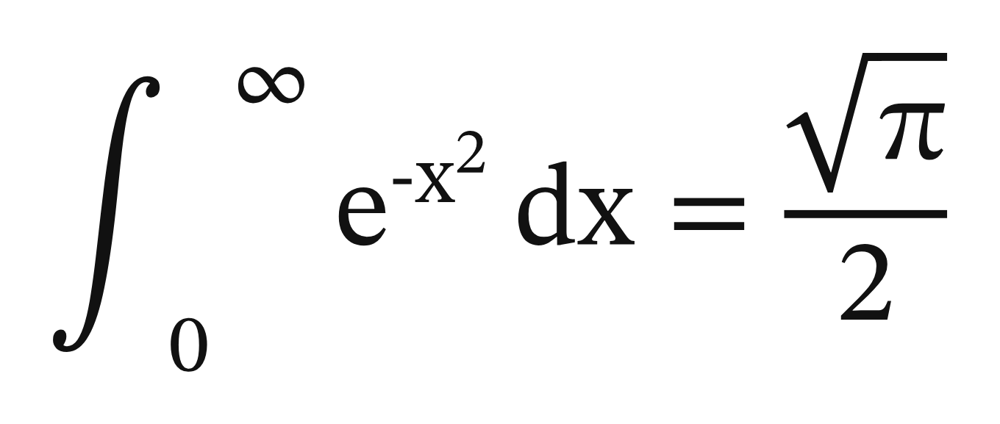
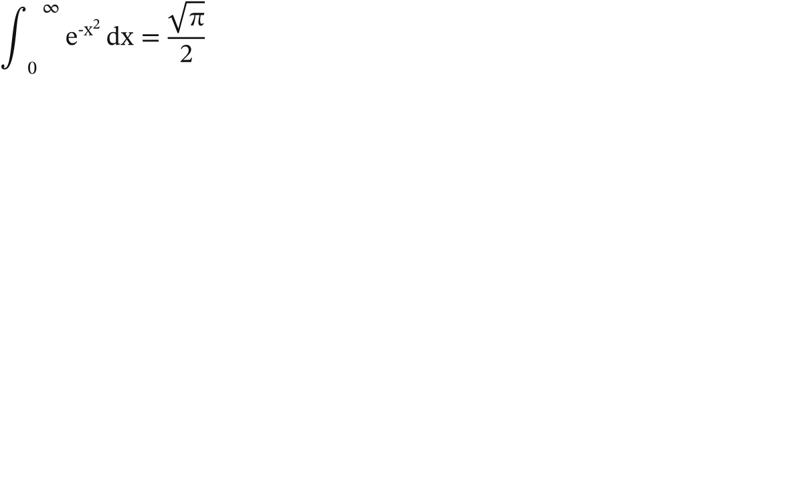

# LatteX ☕

**Math, Y'all** — LaTeX math rendered to SVG, for the JVM.

LatteX is a clean-room, pure-**Java 25** library that renders LaTeX math to **SVG** — inline and display, baseline-accurate — with **zero runtime dependencies**. No JavaScript engine, no headless browser, no external `tex` binary. Point it at `\frac{1}{2}` and get back a crisp, scalable, self-contained `<svg>`.

```java
String svg = com.lattex.api.LatteX.render("\\frac{a+b}{c}");
```

> **Acknowledgments.** LatteX is a *clean-room* implementation — its layout is derived from Knuth's *TeXbook* (Appendix G) and the OpenType-MATH / SVG specifications, not from any existing renderer's source. That said, a grateful hat-tip to **[KaTeX](https://katex.org)**: we used its superb *supported-functions* coverage as a **feature reference** — *what* LaTeX commands are worth supporting — to shape our roadmap. Thanks also to the **STIX Two Math** font (SIL OFL) that LatteX bundles, and to the wider TeX/LaTeX ecosystem it stands on.

## See it

Every failure the render pipeline signals arrives as one typed exception —
`MathSyntaxException`, caret-pointing for syntax errors, containment-wrapped (cause
preserved) for internal layout/emit failures — so an `Error` from the laid-out
pipeline can never escape onto a live page. Inline embedding carries baseline
metrics (`renderInlineResult` → depth/height in em) so prose math sits on the line.
`renderWithDiagnostics` returns a never-throwing `RenderResult` with a Sirentide-parity
`Diagnostics` (outcome/stage/message + caret). Script placement consumes the font's
OpenType math-kern staircases, so subscripts tuck into a slanted glyph (V₁, Pₙ) and
superscripts clear an overhang (f²) exactly as the font intends. Untrusted input is
bounded on every axis — source length, nesting depth, layout fan-out (box budget), and
output size (incremental) — and control characters can never reach the output; a resource
trip degrades to a typed `OUTPUT_CAP_EXCEEDED` diagnostic, never an escaped error.

**[examples/showcase.html](examples/showcase.html)** — a curated tour of what
LatteX renders (every formula on it is regression-locked by the wild-corpus
ratchet: 502/502 real-world formulas, 100%, and only allowed to go up). For the
fx layer in motion, see the **[effects showcase](examples/effects.html)** for the
general runtime grid and **[the fx gallery](examples/GALLERY.md)** for all 29
production effects: 28 motion GIFs plus the deliberately static semantic `thread`
reference. For the parallel MathML
output, **[examples/mathml.html](examples/mathml.html)** shows each formula's SVG
render beside its `toMathML()` serialization — same parse, two products.

For a host that wants an author-visible failure without inventing its own UI,
**[examples/rendered-error.html](examples/rendered-error.html)** shows the opt-in,
bounded error card. The committed image below is captured from the current Java
renderer in a real Chromium session by BrewShot.




<sub>↑ a scroll through <code>examples/showcase.html</code>, captured with <a href="https://github.com/supsup/BrewShot">BrewShot</a> — every frame is real renderer output.</sub>

## Why

The JVM lacks a modern, permissively-licensed, web-first math renderer. KaTeX and MathJax are JavaScript. JLaTeXMath is excellent but old (AWT/image-first) **and GPL**. SnuggleTeX is permissive but limited to MathML. LatteX fills that gap: **Apache-2.0, pure Java, SVG-native.**

## Design

- **Java 25, modern.** The math tree is a `sealed interface` + `record` algebraic data type, laid out with exhaustive pattern-matching switches — no visitor boilerplate.
- **Zero runtime dependencies, framework-free.** No Spring, no anything. A JPMS module you drop in and call. The glyphs come from a bundled OFL math font (STIX Two Math), emitted as SVG `<path>`s — so there are no fonts to load in the browser either.
- **SVG-native, inline-capable.** Output is a minimal, sanitizer-friendly SVG subset — only `<svg>`/`<g>`/`<path>`/`<rect>`, with glyphs as inline filled `<path>`s (no `<text>`/`<use>`/`<defs>`/`<script>`). The renderer exposes each expression's height and depth so inline math sits correctly on the text baseline.
- **Native-image clean.** No reflection; ships GraalVM reachability metadata, and an optional standalone `lattex` native CLI.
- **Design-for-both, ship SVG.** A layout core + pluggable output backends (mirroring TeX's own `dvisvgm`/`dvipng` driver split): SVG natively, with **[`bin/lattex-shot`](#png-export--binlattex-shot)** for a tightly-cropped **PNG** raster (as glue over [BrewShot](https://github.com/supsup/BrewShot), no new dependency).

## Status

Early but real. The parse → layout → SVG pipeline is wired end-to-end: `com.lattex.api.LatteX.render(...)` renders fractions, roots, scripts, big operators, matrices, aligned environments, delimiters, stacked annotations (`\underbrace`/`\overbrace`/`\substack`/`\stackrel`/`\overset`/`\underset`), extensible labelled arrows (`\xrightarrow`/`\xleftarrow`), style-pinned fractions (`\dfrac`/`\tfrac`), per-subterm color (`\color`/`\textcolor`), equation numbering (`\tag`), manual delimiter sizing (`\big`/`\Big`/`\bigg`/`\Bigg`), and bare style switches (`\displaystyle`/`\textstyle`/`\scriptstyle`) to SVG today — **100% of the wild corpus** (502/502). A parallel `LatteX.toMathML(...)` emits **Presentation-MathML** from the same parse tree — navigable structure for assistive tech and an interop surface. The `\lx[...]{...}` author syntax, inline em-sizing + baseline alignment, and the full **28-effect always-on** `fx` layer (including the semantic `thread`, `precedence`, and `cancel` effects) — plus the flag-gated `unfold` click-to-expand `\sum` bloom, for **29 production effects total** — are on the mainline, with parse-time DoS guards. See **[QUICKSTART.md](QUICKSTART.md)** for usage and cross-stack integration.

## Opt-in rendered diagnostics

The historical diagnostic API still returns an empty SVG on failure by default.
A host can explicitly ask LatteX to render a small failure card instead:

```java
RenderOptions options = RenderOptions.defaults().withRenderedErrors(true);
RenderResult result = LatteX.renderWithDiagnostics(
    "\\frac{a + b}{\\sqrt{x^2 + 1}", options);

// result.diagnostics() is still the original typed diagnostic.
// result.svg() is a bounded inert card only when that diagnostic is non-OK.
```

Successful SVG bytes are identical to `LatteX.render(source, options)`. On a
failure, the card contains only a stable outcome name, the bounded diagnostic
message, and at most one bounded source-line excerpt with a reanchored caret.
It never exposes `Diagnostics.detail()`, an exception type/cause, the full raw
source, or `caretString()`. Text becomes direct font-path geometry through the
same capped `svg/g/path/rect` emitter; it is never reparsed as LaTeX.

This is a host-only switch: source authors cannot enable or disable it through
`\lx[...]`. The original overload, throwing render methods, CLI, and Docker
worker all retain their previous defaults and behavior.

## Docker: one-shot CLI or watched folders

The repository ships one Java 25 image with two explicit modes. `cli` preserves
the existing jar's argv/stdin/stdout contract; `watch` keeps running and turns
eligible files dropped into a mounted input folder into self-contained SVGs.
The image builds from source with the checked-in Gradle wrapper, has no BrewShot
or browser runtime dependency, and runs as the dedicated non-root UID/GID
`10001:10001` unless you deliberately map it to your own non-root host IDs.

Build it from the repository root:

```bash
docker build -t lattex:local .
mkdir -p Input Output
```

`Input/` and `Output/` are operator data, not repository artifacts. They are
excluded from the Docker build context; keep them out of commits (or place the
same two folders at any absolute host path and change only the left side of the
mounts below).

### Existing CLI flow

The ordinary CLI works unchanged behind the explicit `cli` mode. The legacy
no-mode spelling is also preserved when its first argument is not one of the
two container mode names, `cli` or `watch`:

```bash
docker run --rm lattex:local cli '\frac{a}{b}' > equation.svg
printf '%s\n' '\sqrt{2}' | docker run --rm -i lattex:local cli > root.svg

# Compatibility form — still the same shipped CLI:
docker run --rm lattex:local '\frac{a}{b}' > equation.svg

# Escape the two reserved first arguments through explicit CLI mode:
docker run --rm lattex:local cli watch > watch-expression.svg
docker run --rm lattex:local cli cli > cli-expression.svg
```

Without the explicit prefix, `docker run ... watch` starts the folder worker
and `docker run ... cli` selects CLI mode with no expression argument. Adding
`cli` first is therefore required when the literal first CLI argument is
`watch` or `cli`; after that prefix, argv/stdin/stdout are passed to the shipped
jar unchanged.

`--help`, `--version`, `--batch`, `--inline`, `--scale`, `--macro`, `--color`,
and `-o/--output` pass through to the jar unchanged. For a mounted source file,
the container-only `cli --input FILE` adapter feeds that file to the same CLI's
stdin. The input mount can therefore be read-only while output stays writable:

```bash
printf '%s\n' '\int_0^1 x^2\,dx' > 'Input/integral.tex'

docker run --rm \
  --user "$(id -u):$(id -g)" \
  -v "$PWD/Input:/lattex/input:ro" \
  -v "$PWD/Output:/lattex/output" \
  lattex:local cli --input '/lattex/input/integral.tex' \
  -o '/lattex/output/integral.svg'
```

### Long-running watch flow

Watch mode must mount `Input` read-write because claiming and completion are
represented by atomic source-file moves. Mapping your non-root host IDs is a
convenient way to make bind-mount ownership honest; omitting `--user` uses the
image's non-root `10001:10001` identity instead.

```bash
docker run -d --name lattex-watch \
  --user "$(id -u):$(id -g)" \
  -v "$PWD/Input:/lattex/input" \
  -v "$PWD/Output:/lattex/output" \
  lattex:local watch

docker logs -f lattex-watch
```

Only visible, regular, direct-child `*.tex` files in `/lattex/input` are jobs.
The worker creates and owns these state folders inside that mount:

```text
/lattex/input/
├── processing/   claimed or restart-recoverable jobs
├── finished/     original sources that rendered successfully
└── failed/       original sources that failed
/lattex/output/   completed SVGs or bounded error diagnostics
```

For `Input/pythagoras.tex`, success atomically publishes
`Output/pythagoras.svg` and preserves the original source name as
`Input/finished/pythagoras.tex`. A render/read failure publishes no success SVG,
writes a bounded non-secret `Output/pythagoras.tex.error.txt`, and moves the
source to `Input/failed/pythagoras.tex`.

Producers should never write a live `.tex` name incrementally. Write a hidden
or otherwise ineligible sibling first, then atomically rename it into the input
root when complete:

```bash
printf '%s\n' '\begin{aligned}' 'a &= b + c \\' 'd &= e' '\end{aligned}' \
  > 'Input/.derivation.tex.tmp'
mv 'Input/.derivation.tex.tmp' 'Input/derivation.tex'
```

Claims are atomic moves into `processing/<job-id>/<original-name>`; keeping the
UUID and source name in separate path components lets filenames near the mount's
component limit remain valid after claiming. Two containers sharing the same
mounts cannot both claim one root source, and valid claims left in `processing/`
are recovered after restart. The prior UUID-prefixed direct-file claim format is
also recovered during upgrades. Unrecognized state entries, hidden files,
symlinks, and non-`.tex` files are never scanned. Existing output or archive
bytes are never overwritten; a distinct name collision is failed explicitly,
and a same-name source-archive collision with different bytes is retained under
that state's `collisions/<job-id>/` directory. Error diagnostics normally keep
the source-based name shown above; unusually long names or an occupied
diagnostic path use a bounded attempt-unique `lattex-<job-id>-<attempt-id>.error.txt`
name instead.

The polling interval defaults to 500 ms and can be set from 10–60000 ms with
`LATTEX_WATCH_POLL_MS`. `LATTEX_INPUT_DIR` and `LATTEX_OUTPUT_DIR` exist for
controlled tests/custom images; the documented container contract remains
`/lattex/input` and `/lattex/output`.

## The fx layer is OPTIONAL

The math renders from the jar **alone** — pure, inert `svg/g/path/rect`, no runtime, safe to inline anywhere. The `\lx` **effects** (glow, handscribe, supernova, shatter, sparkler, precedence, and 22 more — 28 always-on effects total, plus the flag-gated `unfold` described below) are an *opt-in* layer: they ride the `<span class="lx-math" data-lx-fx-*>` wrapper and are driven by a small vanilla-JS runtime **bundled in the jar**. Include it only if you want the animations.

**LatteX is a pure typesetter by default** — it lays out the math you give it and computes nothing from it. The one exception is fully opt-in and doubly gated: the `unfold` effect (a bounded `\sum` blooming into its explicit terms) needs LatteX to pre-render the expanded form, so a small `RenderOptions.interactiveExpansion` flag (**default off**) must be enabled by the host **and** the equation must carry an `fx.*=unfold` directive. With the flag off — the default — the pass never runs, an `unfold` directive degrades inert, and a plain page pays zero cost. Because it is opt-in, `unfold` is not part of the general `examples/effects.html` grid; it gets its own flag-enabled preview instead. See `SumExpansion`.

On the JVM, read the assets straight off the API:

```java
LatteX.fxRuntimeJs()   // the runtime — serve as /js/lattex-fx.js, or inline in a trusted <script>
LatteX.fxStylesCss()   // the styles — serve as /css/lattex-fx.css, or inline in a <style>
```

Not on the JVM? They're plain jar resources — extract them at build time in any stack:

```bash
unzip -p lattex-0.11.0.jar com/lattex/fx/lattex-fx.js  > static/js/lattex-fx.js
unzip -p lattex-0.11.0.jar com/lattex/fx/lattex-fx.css > static/css/lattex-fx.css
```

Either way the consumer gets them **from the jar it already renders with** — no separately-managed asset, and the runtime can never drift from the renderer that stamped the attributes. Three rules from real integrations: extract from the **same jar version** you render with (never a cached copy); ship the js and css **together or not at all** (the css pre-hides `fx.enter` equations for the js to reveal); load the script with `defer` so it runs after the math is in the DOM. Full stack-by-stack walkthrough: **[SLOWSTART.md](SLOWSTART.md)** Scenario 4. Browse the general runtime grid in `examples/effects.html`; the dedicated semantic and flag-gated examples join it in **[the fx gallery](examples/GALLERY.md)**, whose BrewShot visuals are regenerated by `./gradlew generateExamples` and whose enum-to-artifact coverage is build-failing.

## PNG export — `bin/lattex-shot`

LatteX's native output is **SVG** — a *vector* format that stays razor-sharp at any
size. But some destinations don't accept SVG: Slack messages, a GitHub issue body, a
slide deck, an LMS upload. For those you need a **raster** image — a **PNG**, a fixed
grid of pixels. `bin/lattex-shot` produces that PNG.

It is deliberately **glue, not a new dependency**: it doesn't contain a rasterizer of
its own. It shells out to two tools you already have — the LatteX jar (to render the
math) and [BrewShot](https://github.com/supsup/BrewShot), a zero-dependency headless-
Chrome screenshot harness (to turn the rendered page into pixels).

### Quick start

```bash
./gradlew jar                                          # 1. build the lattex jar

bin/lattex-shot '\int_0^\infty e^{-x}dx = 1' -o eq.png # 2a. LaTeX as an argument
echo '\frac{a}{b}' | bin/lattex-shot - -o frac.png     # 2b. or piped via stdin (the '-')
bin/lattex-shot 'E = mc^2' --scale 4 --bg transparent -o hero.png   # 2c. bigger + transparent
```

The first positional argument is the LaTeX math. Passing `-` instead reads the LaTeX
from **stdin**, so you can pipe it from another command or a file (`cat eq.tex | bin/lattex-shot - -o eq.png`).

Here is the actual result — this very PNG was produced by running

```bash
bin/lattex-shot '\int_0^\infty e^{-x^2}\,dx = \frac{\sqrt{\pi}}{2}' --scale 4 -o examples/lattex-shot-example.png
```

and committed straight from the pipeline, nothing hand-touched (the docs eat their own
dog food):



Note what you get for free: the glyphs are razor-sharp (it's vector, rendered at 4×),
the crop hugs the equation exactly, and it's centered with even padding — ready to drop
straight into a doc.

### How it works (the pipeline)

1. **Render.** LatteX turns your LaTeX into a self-contained SVG whose width/height are
   the *exact* typeset metrics of the math (no guessed bounding box).
2. **Wrap.** The SVG is dropped into a minimal one-off HTML page. A wrapper `<div>`
   carries the background color, the ink color, the padding, and the scale.
3. **Scale.** The wrapper is enlarged with a **CSS `transform: scale(N)`** (see the note
   below on *why* a CSS transform rather than resizing the SVG).
4. **Shoot + crop.** BrewShot opens the page in headless Chrome and screenshots the
   wrapper's exact on-screen rectangle (via `getBoundingClientRect()`, which already
   includes the scale and padding). The result is **tightly cropped** to the math — no
   whitespace-trim heuristics, no stray margins.

### Flags

| Flag | Meaning | Default |
|---|---|---|
| `-o FILE` | Output PNG path. | `lattex.png` |
| `--scale N` | **Vector scale factor.** Because the source is SVG (vector), a larger scale means *more pixels* — a genuinely sharper image, **not** a blurry upscale of a small one. `3` is roughly "@3x" / retina-crisp; use `4`+ for hero/print. | `3` |
| `--bg COLOR` | Background — any CSS color. Use **`transparent`** for no background (e.g. to drop the equation onto a colored slide). | `#ffffff` (white) |
| `--color COLOR` | The **ink**: the color of the math glyphs themselves. | `#111111` (near-black) |
| `--pad PX` | Padding (breathing room) around the math, measured **at scale 1** — it is scaled along with everything else. | `16` |

### Setup it needs

- **The LatteX jar** — build it once with `./gradlew jar`. The script auto-finds the
  newest `build/libs/lattex-*.jar`; override the path with the `LATTEX_JAR` env var.
- **BrewShot** — a `brewshot` executable on your `PATH`, or point `BREWSHOT` at the
  binary or `.jar`. (If it's a jar, the script runs it as `java -jar`.)

If either is missing, or the LaTeX renders to nothing, the script exits non-zero with a
one-line reason on stderr (jar/brewshot not found → exit 3; nothing rendered → exit 4).

### What you'd get without it

To see why the scale-and-crop step matters, here is the **same equation** done the
naïve way — just drop LatteX's SVG onto a page and screenshot the window, with no
scaling and no crop:



The math is correct, but it's tiny (native 1× size), stranded in the top-left, and
swimming in whitespace — so you'd be left hand-cropping and upscaling a raster (which
*does* go blurry). `lattex-shot` gives you the sharp, tight top image instead, in one
command. (Naïvely rewriting the SVG's `width`/`height` to scale it up doesn't save you
either: it mis-sizes the box and **clips the edges** — the `√π` and fraction fall off
the right — and can mis-compose glyphs that LatteX places with their own SVG transforms.)

### Why a CSS transform, and why the exact crop

Two implementation choices are what make the top image clean:

- **Scaling is a CSS transform, not an SVG width/height rewrite.** A CSS
  `transform: scale()` enlarges the already-composed picture uniformly, so every glyph
  stays exactly where the layout put it — avoiding the clipping / mis-composition the
  naïve `width`/`height` rewrite above runs into.
- **The crop clips to the rendered box.** Because BrewShot clips to the wrapper's
  measured rectangle (`getBoundingClientRect()`, which already includes the scale and
  padding), the PNG is exactly the math plus your `--pad` — no dependence on fragile
  "trim the surrounding whitespace" image post-processing.

## Build

```bash
./gradlew build
```

Requires a Java 25 toolchain (Gradle provisions it via the toolchain spec).
The normal build includes real-browser BrewShot pins: they launch headless
Chrome when it is available and assumption-skip locally when it is not. CI
sets `LATTEX_REQUIRE_BROWSER=1` so browser absence fails instead of silently
reducing coverage. See [CONTRIBUTING.md](CONTRIBUTING.md#build--test) for the
full test-gate contract.

## License

- **Code:** [Apache-2.0](LICENSE).
- **Bundled math font:** STIX Two Math, under the SIL Open Font License (OFL) — see `NOTICE`.

## Contributing

LatteX is a **clean-room** implementation. Before contributing, read [CONTRIBUTING.md](CONTRIBUTING.md) — in particular the rule that we implement from the *primary sources* (Knuth's TeXbook + the OpenType/SVG specs), **never** from other renderers' code.

## Disclaimer

This project is provided under the Apache License 2.0 on an "AS IS" basis, without warranties or conditions of any kind. See the LICENSE file for details.

## Trusted equation transitions

`InteractiveMath` is a separate trusted-host API for presenting an initial
equation and an alternate form. It renders both endpoints independently through
LatteX's unchanged static renderer, then progressively enhances them with an
honest whole-expression FLIP/crossfade. It does **not** claim to morph matching
glyphs, and it does not add a directive to the author-controlled `\lx` grammar.

```java
import com.lattex.api.InteractiveMath;
import com.lattex.api.InteractiveOptions;
import com.lattex.api.InteractiveResult;

InteractiveResult result = InteractiveMath.render(
    "\\frac{a}{b}",
    "\\frac{b}{a}",
    InteractiveOptions.defaults().withDurationMillis(320));

if (result.status() != InteractiveResult.Status.FAILED) {
    String html = result.html(); // interactive component or one exact static SVG
}
```

Serve the two trusted assets separately and load the script with `defer`:

```java
InteractiveMath.stylesCss(); // serve as /css/lattex-interactive.css
InteractiveMath.runtimeJs(); // serve as /js/lattex-interactive.js
```

```html
<link rel="stylesheet" href="/css/lattex-interactive.css">
<script defer src="/js/lattex-interactive.js"></script>
```

The runtime adds hover preview and an explicit keyboard/click control, honors
`prefers-reduced-motion`, and cleans up detached or document-adopted components.
For dynamically inserted content call `LatteXInteractive.init(scope)`; call
`LatteXInteractive.destroy(scope)` before explicit teardown. Initialization and
teardown are idempotent. With CSS but no successful JavaScript initialization,
both labeled equations remain readable and the control stays hidden.

The default duration is 240 ms and the accepted range is 0–2000 ms. The current
trusted endpoint contract is fixed-size: fluid `RenderOptions` are rejected
because their inline style is outside the pinned minimal-SVG subset. If exactly
one endpoint fails validation or rendering, the typed `STATIC_FALLBACK` result
carries the other exact static SVG; `FAILED` never carries a half-built
component. Combined source, endpoint output, and assembled component sizes are
independently capped, and each endpoint is revalidated against the current
`svg/g/path/rect` contract before it enters the wrapper.

For non-JVM extraction, take both resources from the same JAR version used to
render:

```bash
unzip -p lattex-0.11.0.jar com/lattex/interactive/lattex-interactive.js  > static/js/lattex-interactive.js
unzip -p lattex-0.11.0.jar com/lattex/interactive/lattex-interactive.css > static/css/lattex-interactive.css
```
