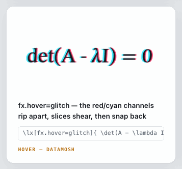
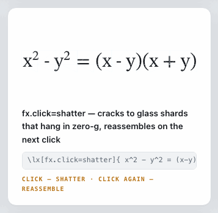
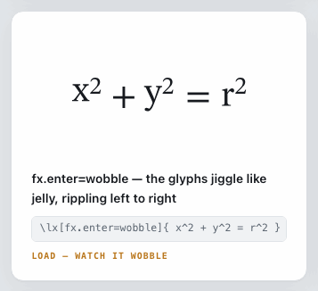

# LatteX — the fx gallery

*(Looking for the math itself rather than the effects? The renderer tour is
[showcase.html](showcase.html) — every formula on it ratchet-locked.)*

*(Want **every** effect in one place, each as its own looping GIF? See
**[fx-catalogue.md](fx-catalogue.md)** — the full 23-effect motion catalogue,
captured with BrewShot's element-targeted `recordGifElement`.)*

Every image here is captured fresh by [BrewShot](https://github.com/supsup/BrewShot)
(the real-browser harness these tests run on) each time the full suite runs.

**These images are for your eyes, not for machines to diff.** The effects
randomize on purpose — glitch's flicker, shatter's shard paths — so two runs
never produce the same pixels, and that's fine. When one of these images
changes in a diff, it isn't a failure; it's an invitation: *the render
changed — take a look and decide if you like what you see.*

The machines still stand guard, just elsewhere: the same captures carry
build-failing checks for the things that are wrong in every run (a glyph
ballooning past 2× its equation, a hover that does nothing, an overlay that
survives scrolling away). So by the time an image reaches this page, it can't
be broken — only different. Whether *different* is *better* is the one call
that stays human.

---

## The effects page

All specimens of the `\lx[fx.*]{…}` catalogue, one card each — enter effects
caught mid-play ([source page](effects.html)):

---

## Effects on film

Hover and click states a still can't show. Each GIF is clipped to its card and
loops forever.

### `fx.hover=glitch` — RGB-split flicker

### `fx.click=shatter` — glass shards in zero-g, then reassembly

### `fx.enter=wobble` — the placement-composed jiggle

The one that earns its keep: wobble rides `setPathDelta`, the
placement-composing transform path. If glyph placement composition ever
regresses (the "blob class"), this capture is where it shows first — and the
suite fails before your eyes get the chance.

---

## The first semantic effect

`fx.thread` — hover a variable and every occurrence of it lights up, driven by
the `data-lx-glyphmap` sidecar ([source page](thread-preview.html)):

---

*Regenerate: `./gradlew test` with a local Chrome (the harness assume-skips
without one). Captures land beside their pages in this directory.*
