# LatteX — the fx gallery

*(Looking for the math itself rather than the effects? The renderer tour is
[showcase.html](showcase.html) — every formula on it ratchet-locked.)*

Every effect in the `\lx[fx.*]{…}` catalogue, each isolated on a one-effect page
and captured as its own looping GIF via [BrewShot](https://github.com/supsup/BrewShot)'s
element-targeted `recordGifElement`. Each one **plays itself** — no hover or click needed.

**These images are for your eyes, not for machines to diff.** The effects randomize on
purpose — glitch's flicker, shatter's shard paths — so two runs never produce the same
pixels, and that's fine. The machines stand guard elsewhere: build-failing checks catch the
things wrong in *every* run (a glyph ballooning past 2× its equation, a hover that does
nothing, an overlay that survives scrolling away). So by the time an image reaches this page
it can't be *broken* — only *different*. Whether different is better is the call that stays human.

---

## The effects page

All specimens at a glance — enter effects caught mid-play ([source](effects.html)):

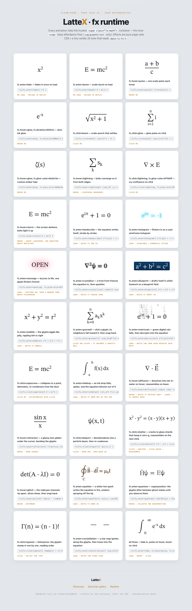

---

## The catalogue, in motion

Each GIF is clipped to its own equation and loops forever; the trigger is shown in its
`\lx[fx.*]` source.

### `fx.click=boom`

```
\lx[fx.click=boom]{ E = mc^2 }
```

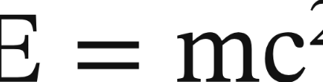

### `fx.hover=pulse`

```
\lx[fx.hover=pulse]{ \oint \vec{B}\cdot d\vec{l} }
```

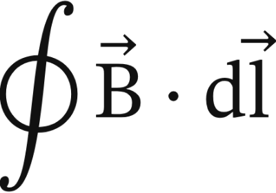

### `fx.enter=fade`

```
\lx[fx.enter=fade]{ a + b = c }
```

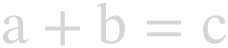

### `fx.click=glow`

```
\lx[fx.click=glow]{ \phi = \frac{1+\sqrt5}{2} }
```

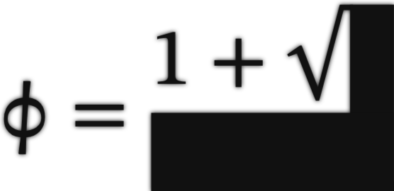

### `fx.click=lightning`

```
\lx[fx.click=lightning]{ \nabla^2 \phi = 0 }
```

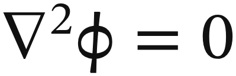

### `fx.hover=storm`

```
\lx[fx.hover=storm]{ i\hbar\,\partial_t\psi }
```

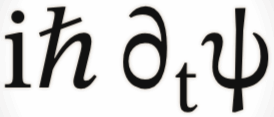

### `fx.enter=handscribe`

```
\lx[fx.enter=handscribe]{ e^{i\pi}+1=0 }
```

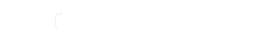

### `fx.enter=hologram`

```
\lx[fx.enter=hologram]{ \psi(x,t) }
```

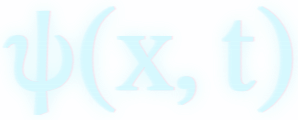

### `fx.enter=neonsign`

```
\lx[fx.enter=neonsign]{ \int_a^b f\,dx }
```

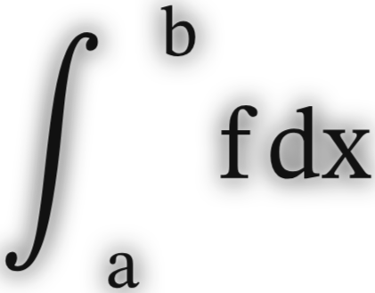

### `fx.enter=crystallize`

```
\lx[fx.enter=crystallize]{ \zeta(s)=\sum n^{-s} }
```

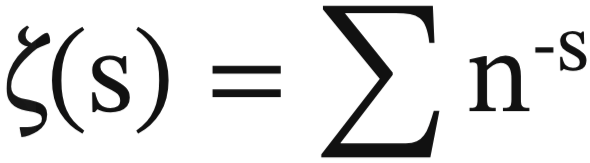

### `fx.enter=blueprint`

```
\lx[fx.enter=blueprint]{ \frac{d}{dx}e^x=e^x }
```

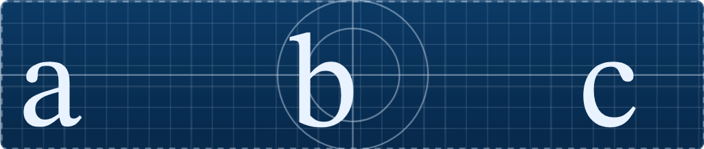

### `fx.enter=wobble`

```
\lx[fx.enter=wobble]{ x^2 + y^2 = r^2 }
```

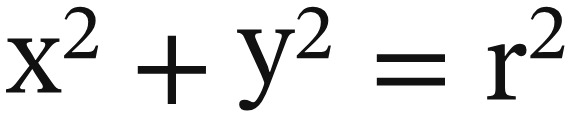

### `fx.enter=gravwell`

```
\lx[fx.enter=gravwell]{ \sum_{n=1}^\infty \frac1{n^2} }
```

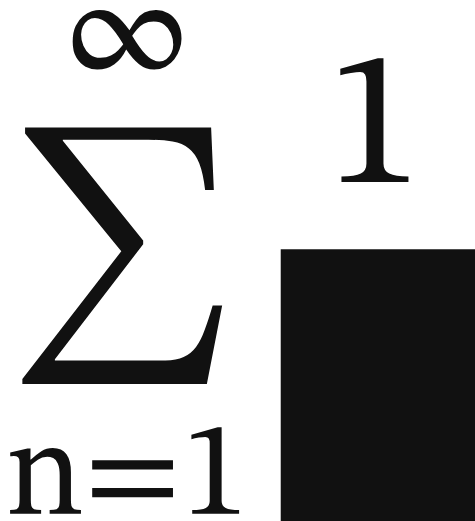

### `fx.enter=matrixrain`

```
\lx[fx.enter=matrixrain]{ \begin{pmatrix}a&b\\c&d\end{pmatrix} }
```

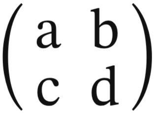

### `fx.click=supernova`

```
\lx[fx.click=supernova]{ c = 3\times10^8 }
```

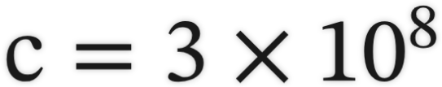

### `fx.hover=diffusion`

```
\lx[fx.hover=diffusion]{ \partial_t u = D\nabla^2 u }
```

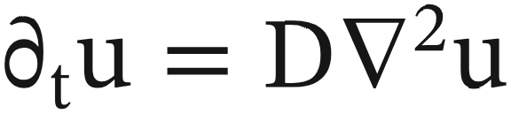

### `fx.click=teleport`

```
\lx[fx.click=teleport]{ |\psi\rangle }
```

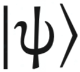

### `fx.click=shatter`

```
\lx[fx.click=shatter]{ a^2-b^2=(a-b)(a+b) }
```

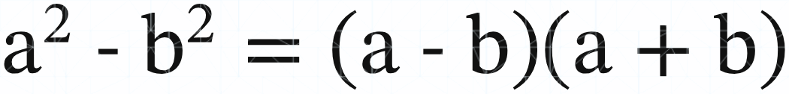

### `fx.hover=glitch`

```
\lx[fx.hover=glitch]{ \nabla\cdot \vec{E}=\rho }
```

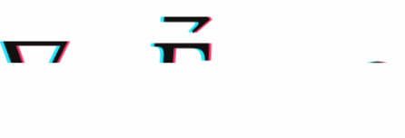

### `fx.enter=sparkler`

```
\lx[fx.enter=sparkler]{ \gamma\approx 0.5772 }
```

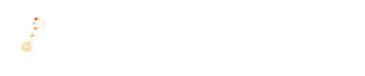

### `fx.enter=quantum`

```
\lx[fx.enter=quantum]{ \Delta x\,\Delta p\ge\hbar/2 }
```

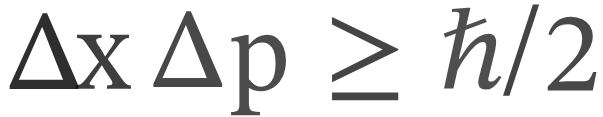

### `fx.click=typeset`

```
\lx[fx.click=typeset]{ \Gamma(n)=(n-1)! }
```

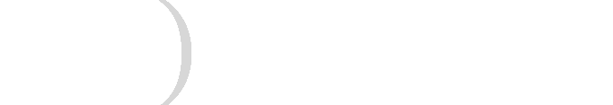

### `fx.enter=constellation`

```
\lx[fx.enter=constellation]{ \pi\approx 3.14159 }
```

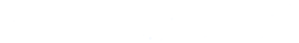

---

## The first semantic effect

`fx.thread` — hover a variable and every occurrence lights up, driven by the
`data-lx-glyphmap` sidecar ([source page](thread-preview.html)):

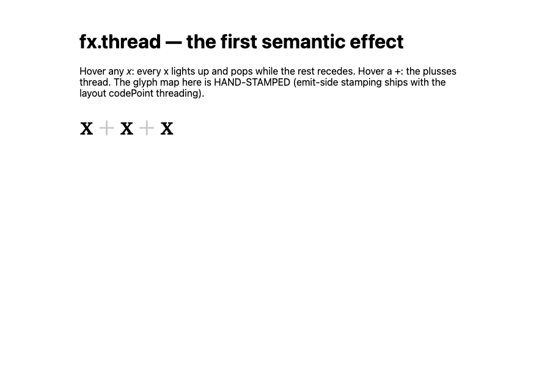

---

*Regenerate: capture with a local Chrome via BrewShot `recordGifElement` (see the fx-catalogue
capture harness). `gravwell` needs a synthetic glyph-click; `refraction`/`inkdrop` await the
pointer-stream (`recordGifStream`) path.*
