# LatteX — the fx gallery

*(Looking for the math itself rather than the effects? The renderer tour is
[showcase.html](showcase.html) — every formula on it ratchet-locked.)*

The production `Effect` vocabulary currently has **29 real effects**: 28 work from
the ordinary runtime and `unfold` additionally needs the host's interactive-expansion
flag. Every one has a declared visual specimen captured with
[BrewShot](https://github.com/supsup/BrewShot): 28 motion GIFs, plus one deliberately
static `thread` reference that keeps all matching glyphs visible together. Captures use
the effect's real path — page entry, trusted hover/click, moving pointer, semantic
sidecar, or flag-enabled toggle — rather than making every interaction pretend to be
the same autoplay animation.

**These images are for your eyes, not for machines to diff.** The effects randomize on
purpose — glitch's flicker, shatter's shard paths — so two runs never produce the same
pixels, and that's fine. The machines stand guard elsewhere: build-failing checks catch the
things wrong in *every* run (a glyph ballooning past 2× its equation, a hover that does
nothing, an overlay that survives scrolling away). So by the time an image reaches this page
it can't be *broken* — only *different*. Whether different is better is the call that stays human.

---

## The effects page

All specimens at a glance — enter effects caught mid-play ([source](effects.html)):

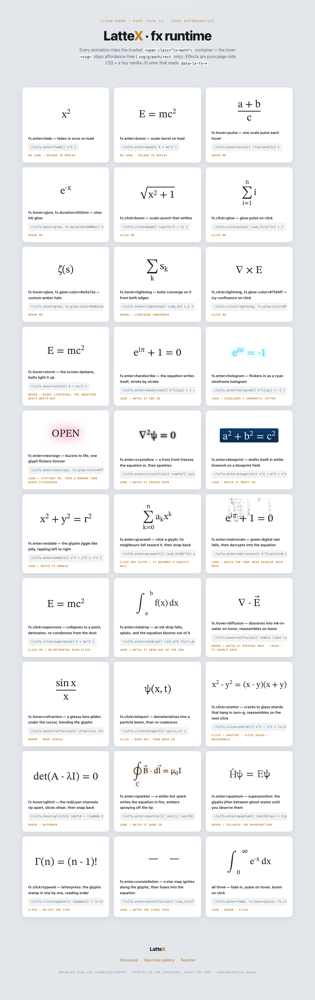

---

## The catalogue, in motion

Each GIF is clipped to its own equation and loops forever; the trigger is shown in its
`\lx[fx.*]` source.

### `fx.click=boom`

```
\lx[fx.click=boom]{ E = mc^2 }
```

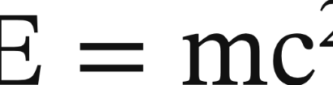

### `fx.hover=pulse`

```
\lx[fx.hover=pulse]{ \oint \vec{B}\cdot d\vec{l} }
```

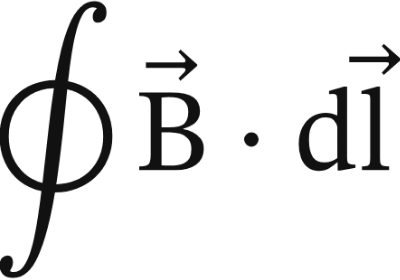

### `fx.enter=fade`

```
\lx[fx.enter=fade]{ a + b = c }
```

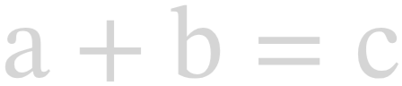

### `fx.click=glow`

```
\lx[fx.click=glow]{ \phi = \frac{1+\sqrt5}{2} }
```

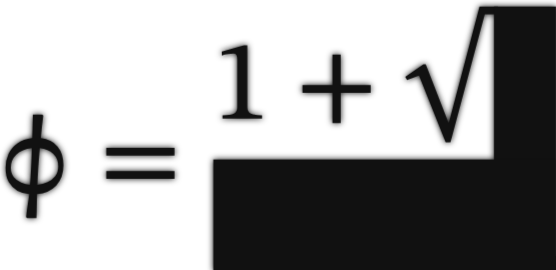

### `fx.click=lightning`

```
\lx[fx.click=lightning]{ \nabla^2 \phi = 0 }
```

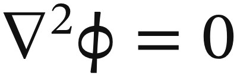

### `fx.hover=storm`

```
\lx[fx.hover=storm]{ i\hbar\,\partial_t\psi }
```

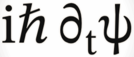

### `fx.enter=handscribe`

```
\lx[fx.enter=handscribe]{ e^{i\pi}+1=0 }
```


### `fx.enter=hologram`

```
\lx[fx.enter=hologram]{ \psi(x,t) }
```

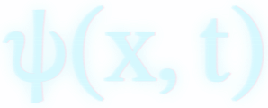

### `fx.enter=neonsign`

```
\lx[fx.enter=neonsign]{ \int_a^b f\,dx }
```

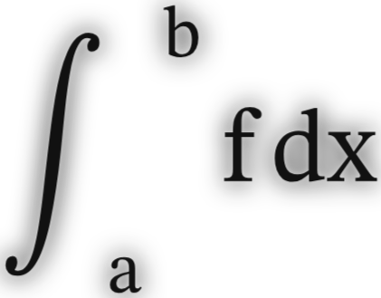

### `fx.enter=crystallize`

```
\lx[fx.enter=crystallize]{ \zeta(s)=\sum n^{-s} }
```

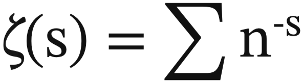

### `fx.enter=blueprint`

```
\lx[fx.enter=blueprint]{ \frac{d}{dx}e^x=e^x }
```

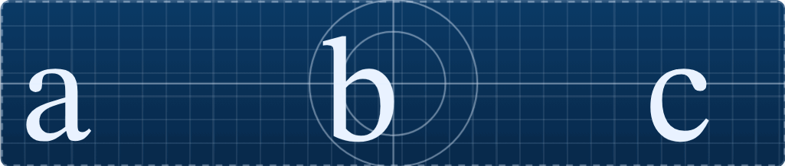

### `fx.enter=wobble`

```
\lx[fx.enter=wobble]{ x^2 + y^2 = r^2 }
```

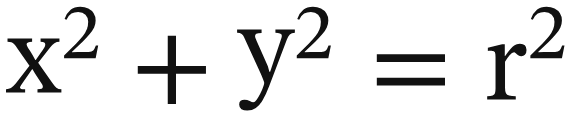

### `fx.enter=gravwell`

```
\lx[fx.enter=gravwell]{ \sum_{n=1}^\infty \frac1{n^2} }
```

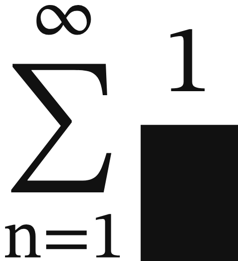

### `fx.enter=matrixrain`

```
\lx[fx.enter=matrixrain]{ \begin{pmatrix}a&b\\c&d\end{pmatrix} }
```

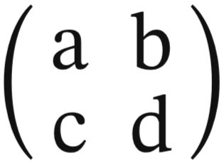

### `fx.click=supernova`

```
\lx[fx.click=supernova]{ c = 3\times10^8 }
```

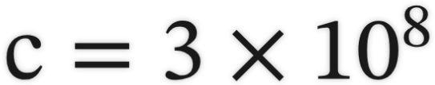

### `fx.enter=inkdrop`

```
\lx[fx.enter=inkdrop]{ \int_a^b f(x)\,dx }
```

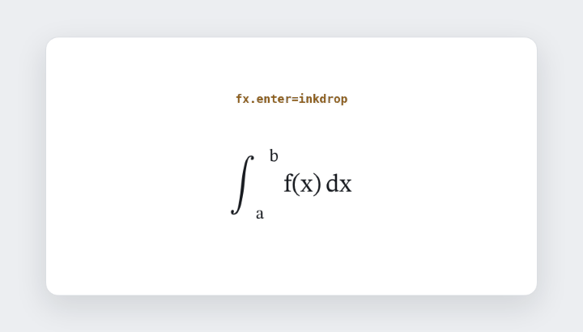

### `fx.hover=diffusion`

```
\lx[fx.hover=diffusion]{ \partial_t u = D\nabla^2 u }
```

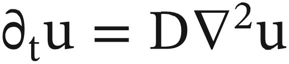

### `fx.hover=refraction`

```
\lx[fx.hover=refraction]{ \frac{\sin x}{x} }
```

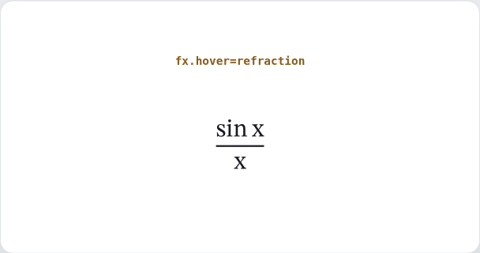

### `fx.click=teleport`

```
\lx[fx.click=teleport]{ |\psi\rangle }
```

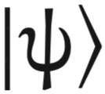

### `fx.click=shatter`

```
\lx[fx.click=shatter]{ a^2-b^2=(a-b)(a+b) }
```

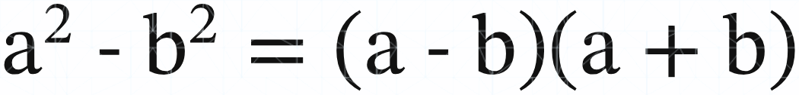

### `fx.hover=glitch`

```
\lx[fx.hover=glitch]{ \nabla\cdot \vec{E}=\rho }
```

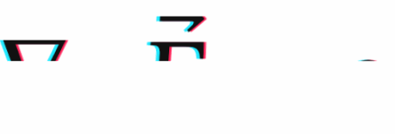

### `fx.enter=sparkler`

```
\lx[fx.enter=sparkler]{ \gamma\approx 0.5772 }
```

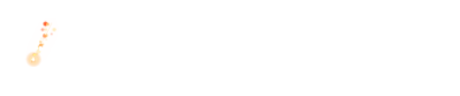

### `fx.enter=quantum`

```
\lx[fx.enter=quantum]{ \Delta x\,\Delta p\ge\hbar/2 }
```

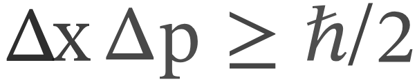

### `fx.click=typeset`

```
\lx[fx.click=typeset]{ \Gamma(n)=(n-1)! }
```


### `fx.enter=constellation`

```
\lx[fx.enter=constellation]{ \pi\approx 3.14159 }
```


---

## Semantic effects

These read structure the renderer emits as a sidecar, so the animation reflects
what the equation *means*, not just how its glyphs sit.

`fx.thread` — hover a variable and every occurrence lights up, driven by the
`data-lx-glyphmap` sidecar ([source page](thread-preview.html)):

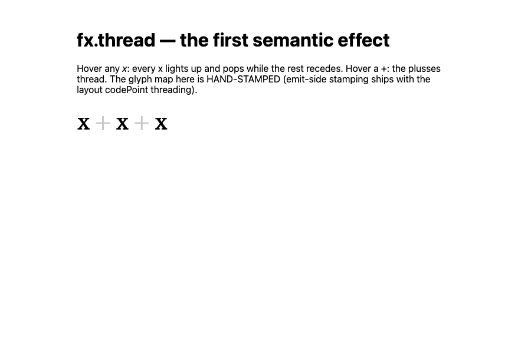

`fx.enter=precedence` — the order-of-operations cascade. A fenced expression
lights up in *evaluation order* (innermost group first, then outward), driven by
the renderer-emitted `data-lx-groupmap` sidecar so the runtime never guesses
precedence from presentation markup. Fenced-only and fail-honest: when grouping
can't be reconstructed from the delimiters the effect degrades to inert rather
than teach wrong binding.

```
\lx[fx.enter=precedence]{ \left( a + b \right) \times \left( c - d \right) }
```

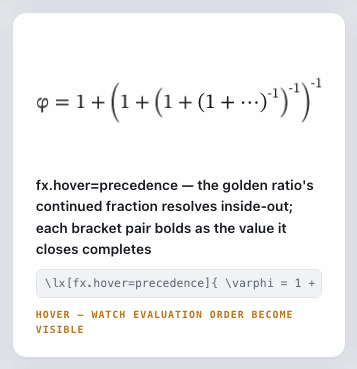

`fx.enter=cancel` — the exactly-twice semantic strike. The real producer stamps
`data-lx-glyphmap` for `\frac{x}{x}`; on entry the matching factors strike out,
puff away, and settle to a readable gray ghost
([source page](cancel-preview.html)).

```
\lx[fx.enter=cancel]{ \frac{x}{x} }
```

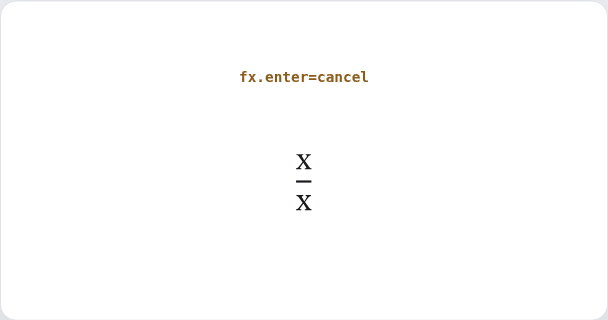

`fx.click=unfold` — the double-gated bounded-sum bloom. This specimen is rendered
with `RenderOptions.interactiveExpansion` enabled, then receives two trusted clicks:
the first reveals the pre-rendered `f(1)+f(2)+f(3)+f(4)` payload and the second
collapses it back to the sum ([source page](unfold-preview.html)).

```
\lx[fx.click=unfold]{ \sum_{i=1}^{4} f(i) }
```

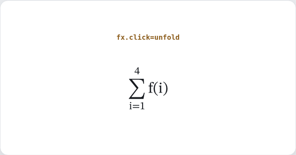

`fx.click=substitute` — the double-gated variable flip, and unfold's sibling in the
numeric-substitution family. Rendered with `RenderOptions.interactiveExpansion`
enabled, it receives two trusted clicks: the first dims the `x` glyphs (located
through the `data-lx-var` sidecar) and reveals the pre-rendered `3^2 + 2 \cdot 3 + 1`
payload, already closed up around the gap the variable left; the second returns to the
variable form.

Note the `\cdot`. Implicit multiplication is written by adjacency, but adjacency
between two digits is positional notation — so substituting `3` into `2x` has to
produce a product and not the number twenty-three.

```
\lx[fx.click=substitute, fx.substitute-to=3]{ x^2 + 2x + 1 }
```

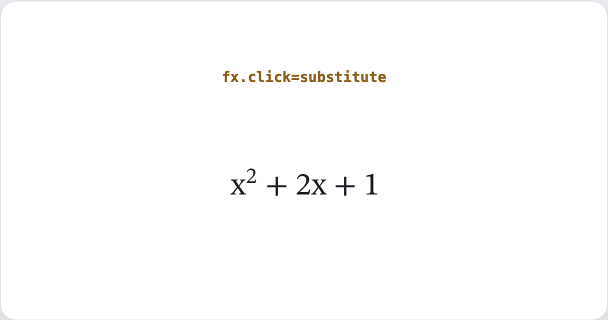

---

*Regenerate through `./gradlew generateExamples`. The BrewShot capture harness uses
compositor streaming for `inkdrop`, trusted moving-pointer input for `refraction`, the
deterministic semantic entry path for `cancel`, and the host-flagged trusted click toggle
for `unfold` and `substitute`. The headless gallery coverage test fails if a future
production effect has no declared artifact or if this document points at a missing file.*
