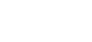

# LatteX fx — the effect catalogue, in motion

Every `\lx[fx.*]` effect, isolated and captured as its own looping GIF via [BrewShot](https://github.com/supsup/BrewShot) `recordGifElement`. Each plays itself — no hover or click needed. **23 effects.**

### `fx.click=boom`

```
\lx[fx.click=boom]{ E = mc^2 }
```


### `fx.hover=pulse`

```
\lx[fx.hover=pulse]{ \oint \vec{B}\cdot d\vec{l} }
```


### `fx.enter=fade`

```
\lx[fx.enter=fade]{ a + b = c }
```


### `fx.click=glow`

```
\lx[fx.click=glow]{ \phi = \frac{1+\sqrt5}{2} }
```


### `fx.click=lightning`

```
\lx[fx.click=lightning]{ \nabla^2 \phi = 0 }
```


### `fx.hover=storm`

```
\lx[fx.hover=storm]{ i\hbar\,\partial_t\psi }
```


### `fx.enter=handscribe`

```
\lx[fx.enter=handscribe]{ e^{i\pi}+1=0 }
```


### `fx.enter=hologram`

```
\lx[fx.enter=hologram]{ \psi(x,t) }
```


### `fx.enter=neonsign`

```
\lx[fx.enter=neonsign]{ \int_a^b f\,dx }
```


### `fx.enter=crystallize`

```
\lx[fx.enter=crystallize]{ \zeta(s)=\sum n^{-s} }
```


### `fx.enter=blueprint`

```
\lx[fx.enter=blueprint]{ \frac{d}{dx}e^x=e^x }
```


### `fx.enter=wobble`

```
\lx[fx.enter=wobble]{ x^2 + y^2 = r^2 }
```


### `fx.enter=matrixrain`

```
\lx[fx.enter=matrixrain]{ \begin{pmatrix}a&b\\c&d\end{pmatrix} }
```


### `fx.click=supernova`

```
\lx[fx.click=supernova]{ c = 3\times10^8 }
```


### `fx.enter=inkdrop`

```
\lx[fx.enter=inkdrop]{ \nabla\times \vec{E} }
```



### `fx.hover=diffusion`

```
\lx[fx.hover=diffusion]{ \partial_t u = D\nabla^2 u }
```


### `fx.click=teleport`

```
\lx[fx.click=teleport]{ |\psi\rangle }
```


### `fx.click=shatter`

```
\lx[fx.click=shatter]{ a^2-b^2=(a-b)(a+b) }
```


### `fx.hover=glitch`

```
\lx[fx.hover=glitch]{ \nabla\cdot \vec{E}=\rho }
```


### `fx.enter=sparkler`

```
\lx[fx.enter=sparkler]{ \gamma\approx 0.5772 }
```


### `fx.enter=quantum`

```
\lx[fx.enter=quantum]{ \Delta x\,\Delta p\ge\hbar/2 }
```


### `fx.click=typeset`

```
\lx[fx.click=typeset]{ \Gamma(n)=(n-1)! }
```


### `fx.enter=constellation`

```
\lx[fx.enter=constellation]{ \pi\approx 3.14159 }
```


---

_Capture pending: gravwell, refraction — pointer-tracked/click-anywhere effects that need live-input capture (a follow-up)._
